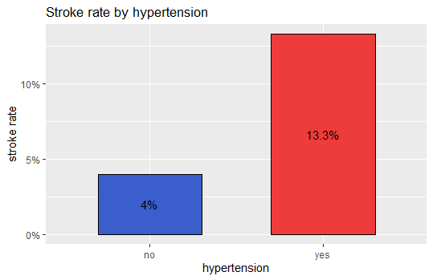
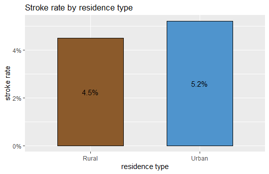
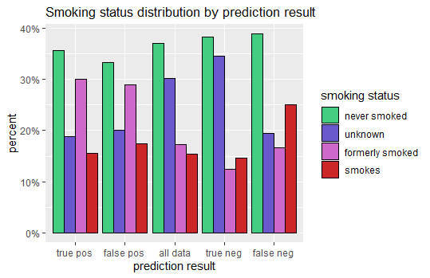

```{r setup, include=FALSE}
knitr::opts_chunk$set(echo = FALSE, warning = FALSE, message = FALSE)
```

# Introduction

According to the [CDC](https://www.cdc.gov/stroke/index.htm), strokes are a
leading cause of death in the US, and are a major cause of serious disability
for adults. Nearly 800,000 people in the US have a stroke each year.

This report presents a modeling process designed to predict stroke events and
assess stroke risk in patients. The data set used can be found
[here](https://www.kaggle.com/fedesoriano/stroke-prediction-dataset). It
consists of 5110 observations, each one containing a patient's clinical
features, a unique ID number, and whether or not they have had a stroke. The
clinical features include gender, age, hypertension, heart disease, work type,
residence type, marriage status, average glucose level, body mass index, and
smoking status.

The goal of this project is to build a model that predicts stroke events with as
much accuracy as possible given the predictors with which we are working.
However, raw accuracy is not a useful metric because we can achieve over 95%
accuracy by simply predicting "no" for all cases. This is because stroke events
are rare, occurring in less than 5% of all observations. In light of this, we
use the receiver operating characteristic (ROC) curve as our metric for
accuracy. By maximizing the area under the ROC curve (AUC) for our model, we
ensure that it will produce both high sensitivity and high specificity, and thus
a high balanced accuracy. We aim to achieve results with comparable sensitivity
and specificity, with slight favor towards sensitivity, as we prefer false
positives to false negatives. 

First, we download and lightly clean our data set. Next, we explore the data,
looking for trends in the variables. We examine the total distributions of each
variable, as well as the stroke event rates within each variable. This provides
insight on how best to approach the modeling process, particularly the benefits
of using class weights and analyzing ROC curves to determine optimal probability
thresholds for classification.

After data exploration, we perform some preprocessing to impute missing data and
transform categorical variables into numerical ones using one hot encoding. We
also create an alternate version of the data where the continuous variables are
stratified into categorical intervals, producing a categorical matrix. This
categorical matrix is used to build one final model after using the caret
package to build several others. 

Once our data is ready, we divide it into training and test sets, and begin
building our models. Ideally, we would further subdivide our training set into a
training and test set, reserving our initial test set solely for final
validation. However, due to the small size of our data set, further division of
the training set will drastically curtail the accuracy of our model. Instead, we
simulate a final validation set by randomly sampling 10,000 observations from
our full data set and using this for our final test. We replicate this process
5 times and average the results for evaluation of our final model.

After our final test, we create a risk assessment aspect for our model using 4
probability threshold markers. This divides all observations into 5 categories
of risk ranging from very low to very high. We assign risk levels to our full
data set, and observe the results.

Finally, we divide our data into prediction categories of true and false
positives and negatives, and compare variable distributions for these 4
categories against each other and the full data set in order to gain further
insight into the performance of our model.

\newpage

# Data exploration

## Getting started

We begin by downloading our data set and loading the necessary libraries:

```{r loading libs, echo = TRUE}
library("tidyverse")
library("readr")
library("varhandle")
library("caret")
library("e1071")
library("pROC")
library("RANN")
library("randomForest")
library("ranger")
library("rpart")
library("gbm")
library("nnet")
```

We read in the .csv file to an .rda and examine its structure. We lightly clean
the data by removing the id column, converting the body mass index (bmi) column
from character to numeric, and converting the stroke column to a factor. Our
data structure now looks like this:

```{r clean data}
dat <- read_csv("healthcare-dataset-stroke-data.csv")
dat <- dat %>%
  select(-id) %>%
  mutate(bmi = as.numeric(bmi)) %>%
  mutate(stroke = as.factor(stroke))
library(magrittr)
data.frame(variable = names(dat),
           class = sapply(dat, class),
           first_values = sapply(dat, function(x) paste0(head(x, 4),
                                                         collapse = ", ")),
           row.names = NULL) %>% 
  knitr::kable()
```

We notice there is at least one missing data point. We count the number of NA's
in each column and find there are 201 NA's, all in the bmi column. We leave them as is for now:

```{r count NAs}
data.frame(number_of_NAs = colSums(is.na(dat))) %>% 
  knitr::kable()
```

## Examine variable distributions

<p>

</p>

We notice a higher percentage of females, and 1 observation with gender "Other".

<p>

</p>

We notice that all age groups are represented fairly well, with the highest age
being 82.

\newpage

<p>

</p>

We note that just under 10% of our observations have high blood pressure.

<p>

</p>

While just over 5% of our observations have heart disease.

\newpage

<p>

</p>

We see about 2/3 of our observations have been married before.

<p>

</p>

We see that the majority of our observations work in the private sector, while
very few have never worked.

\newpage

<p>

</p>

We see a pretty even split between urban and rural residence types.


</p>

We see a bimodal average glucose distribution with a tall peak in the healthy
range and a much shorter peak in the diabetic range.

\newpage

<p>

</p>

We see a mostly normal distribution for body mass index with a fatter tail on
the high end.

<p>

</p>

We see that over 1/3 of our cases have never smoked, and over 30% have unknown
smoking status.

\newpage

<p>

</p>

We see that just under 5% of our observations have had a stroke event.

## Examine correlations between variables and stroke events

<p>

</p>

We notice the stroke rate for males is slightly above average while the stroke
rate for females is slightly below average.

\newpage


</p>

We see the age distribution for observations with stroke events is much higher
than for those without, with virtually no overlap in the interquartile ranges.
Note only 2 cases under age 30 had strokes.

<p>

</p>

We see the stroke rate increases dramatically with age once people are into their
50's and 60's.

\newpage

<p>

</p>

We see that people with high blood pressure have a much higher stroke rate
than those without.

<p>

</p>

Note that when we plot age distribution by hypertension status, we see that
those with hypertension tend to be older than those without. So at least some of
the disparity can be attributed to correlation with age here.

\newpage

<p>

</p>

Those with heart disease also have a much higher stroke rate than those without.

<p>

</p>

Again, when we plot age distribution by heart disease status, we see that those
with heart disease tend to be much older than those without. This indicates that
we can attribute some of the increase in rate to age.

\newpage

<p>

</p>

We see that people who have been married have a higher stroke rate than those
who have not.

<p>

</p>

Again, looking at age distribution by marriage status, we see
that people who have been married are generally much older than those who have
not.

\newpage

<p>

</p>

We observe that people who are self-employed have a higher stroke rate than
those who are not, while children and those who have never worked have extremely
low stroke rates.

<p>

</p>

Again, we notice that these categories exhibit a respective correlation with
age.

\newpage

<p>

</p>

We see the stroke rate for urban dwellers is slightly above average while the
stroke rate for rural dwellers is slightly below average.

<p>

</p>

We see the age distributions for each residence type are nearly identical,
indicating that the variation here cannot be attributed to a correlation with
age.

\newpage

<p>

</p>

We see that people who have had strokes tend to have higher average glucose
levels than those who have not had strokes.

<p>

</p>

We see the stroke rate increases dramatically when average glucose levels
surpass 160, indicating prediabetes. We note a weak positive correlation
between age and average glucose levels (coefficient = 0.238), indicating that
some of the increase can be attributed to age.

\newpage

<p>

</p>

We see that people who have had strokes tend to have a slightly higher body mass
index than those who have not had strokes.

<p>

</p>

We observe the stroke rate increases with BMI , topping out at 6% around a BMI
of 30, and varying between 4% and 6% after that. We note a weak correlation
between age and BMI (coefficient = 0.337), again indicating that some of the
increase can be attributed to age. Keep in mind we are missing 201 data points
in the BMI column, which may be distorting our analysis.

\newpage

<p>

</p>

We see that people who used to smoke have the highest stroke rate, while those
with unknown status have the lowest. People who smoke have an above average
stroke rate, while people who never smoked have a below average stroke rate.

<p>

</p>

Once again, we observe some age correlations that can account for some of the
variation here.

\newpage

# Model the data

## Preprocess the data

Before we can begin building our models, we need to perform some preprocessing
on our data. The first step in this regard is deciding what to do with our 201
missing data points in the BMI column. Exploring these observations, we find
that 40 of them are cases with stroke events, representing over 16% of our total
stroke events. We also note that the age in these observations tends to be
higher than average. As these observations represent a significant portion of
our data, we use the `bagImpute` method in the `preProcess()` function of the
**caret** package, along with the **RANN** package, to guess these values based
on the values of the other variables in each observation.

Next, we arbitrarily set the gender to "Male" for the case where gender is
input as "Other," as this one observation will offer no statistical significance
in our modeling. Then we convert all of our categorical variables to factors.

Here we create two different versions of our data, one for building a model
ourselves, and one for building models with the **caret** package.

**Version 1:** We stratify our continuous variables (age, average glucose
level, BMI) and consolidate any outlying tails into a single stratum. This
reduces outlier distortion in our data by ensuring that each stratum has more
than a handful of observations. We stratify age by every 5 years, average
glucose level by every 20 points, and BMI by every 3 points. For the sake of
ease, we change our stroke factor levels from "0" and "1" to "yes" and "no."

**Version 2:** We employ one hot encoding on our categorical variables. This
produces an all numeric matrix with our categorical variables represented by 0's
and 1's. Again, we change the stroke factor levels to "yes" and "no."

```{r prepare data for model training}
load("rdas/dat_processed.rda")
strat <- dat %>%
  mutate(age = ceiling(age / 5)) %>%
  mutate(avg_glucose_level = ceiling(avg_glucose_level / 20)) %>%
  mutate(avg_glucose_level = ifelse(avg_glucose_level > 11,
                                    12, avg_glucose_level)) %>%
  mutate(bmi = ceiling(bmi / 3)) %>%
  mutate(bmi = case_when(bmi < 7 ~ 6,
                         bmi > 15 ~ 16,
                         TRUE ~ bmi))
levels(strat$stroke) <- c("no", "yes")
dat$stroke <- unfactor(dat$stroke)
dummy <- dummyVars( ~ ., data = dat, fullRank = TRUE)
dat <- data.frame(predict(dummy, dat))
dat$stroke <- factor(dat$stroke)
levels(dat$stroke) <- c("no", "yes")
dat <- as_tibble(dat)
```

## Partition the data

Our data is almost ready for training and building models. We use the
`createDataPartition()` function from the **caret** package to split the data into
training and test sets, using a 90/10 split. Ideally we would partition the
training set further into smaller training and test sets, reserving the initial
test set solely for final validation of our model. However, the data set is a
bit small for this, and doing so would significantly reduce our model accuracy.
We will instead simulate a final test by randomly sampling 10,000 observations
from our full data set before making predictions with our model. We will
replicate this process 5 times and average the results for our final evaluation.

```{r create train and test sets}
set.seed(23, sample.kind = "Rounding")
test_index <- createDataPartition(dat$stroke, times = 1, p = 0.1, list = FALSE)
test_index <- as.vector(test_index)
test <- dat[test_index,]
train <- dat[-test_index,]
test_strat <- strat[test_index,]
train_strat <- strat[-test_index,]
```


## Train the models

### **rf** model

We use the `train()` function from the **caret** package with the `rf` method from
the **randomForest** package to train a random forest model on our training set.
We set up our train control function to perform 5 fold cross validation repeated
3 times. We use `twoClassSummary` as our summary function and set
`classProbs = TRUE`. We use `metric = "ROC"` so that our model will maximize the
area under the ROC curve and optimize independently of probability threshold,
favoring a high balanced accuracy over raw accuracy. We can achieve over 95%
accuracy by guessing "no" for all observations because of the class imbalance of
our data, but this produces a balanced accuracy of only 50%.

We train our model and look at the 6 most important variables:

```{r rf model varImp}
load("rdas/train_rf.rda")
varImp(train_rf)$importance %>%
  arrange(desc(Overall)) %>%
  head() %>%
  rename(Importance = Overall) %>%
  knitr::kable()
```

We make predictions on our test set using the `predict()` function from the
**stats** package and find that our model predicted "no" for every observation.
This is not helpful. We explore to see what has happened.

We use the `roc()` and `auc()` functions from the **pROC** package to extract
data from our model for plotting the ROC curve and calculating the AUC, which we
find to be 0.8489:

<p>

</p>

We see from the ROC curve that we can adjust the probability threshold of our
model to obtain equal sensitivity and specificity close to 80%.

We use the `predict()` function again, this time using the argument 
`type = "probs"` to obtain from our model the predicted probability of a
positive outcome, stroke = "yes", for each observation. Looking at the
distribution of these probabilities for the cases where stroke = "yes", we see:

```{r rf probs stroke yes}
probs_rf <- predict(train_rf, test, type = "prob")$yes
sum <- summary(probs_rf[test$stroke == "yes"])
data.frame(min = sum[[1]], Q1 = sum[[2]], median = sum[[3]],
           mean = sum[[4]], Q3 = sum[[5]], max = sum[[6]]) %>%
  `row.names<-`('p | stroke = "yes"') %>%
  knitr::kable()
```

The distribution of probabilities for cases where stroke = "no":

```{r rf probs stroke no}
sum <- summary(probs_rf[test$stroke == "no"])
data.frame(min = sum[[1]], Q1 = sum[[2]], median = sum[[3]],
           mean = sum[[4]], Q3 = sum[[5]], max = sum[[6]]) %>%
  `row.names<-`('p | stroke = "no"') %>%
  knitr::kable()
```

We see that all of the probabilities are less than 0.5. This is why our model
predicted "no" for all observations. Adjusting the probability threshold will
allow us to greatly improve the performance of our model.

Comparing the distributions, we see that a probability threshold between 0.057
and 0.074 will produce sensitivity and specificity above 75%. Setting the
threshold to 0.07, we obtain:

```{r rf_07 results}
pred_rf_07 <- as.factor(ifelse(probs_rf > 0.07, "yes", "no"))
cm <- confusionMatrix(pred_rf_07, test$stroke, positive = "yes")
acc <- unname(cm$byClass[[11]])
sens <- unname(cm$byClass[[1]])
spec <- unname(cm$byClass[[2]])
data.frame(model = "rf_07", balanced_accuracy = acc,
           sensitivity = sens, specificity = spec) %>%
  knitr::kable()
```

### **ranger** model with weights

We saw that once we adjusted the probability threshold of our `rf` model, it
performed relatively well. For our next model, we will again use a random
forest, this time introducing class weights into the training function. This
will impose a heavier cost for false negative predictions and improve model
performance with a probability threshold of 0.5.

To determine the class weights, we divide 1 by the number of occurrences of each
class in the training set, and divide that by 2. This ensures that the ratio of
the weights is equal to the ratio of the prevalence of each class, and that the
weights all add to 1.

$$
w_{yes} = \frac{1}{2N_{yes}}
$$

$$
w_{no} = \frac{1}{2N_{no}}
$$

We assign the weights to each observation and we are ready to set up and train
our next model.

We use the `ranger` method from the **ranger** package for our model. After some
preliminary testing, we set up the tune grid and use the same train control
function from our first model. We use the argument `importance = "permutation"`
in the `train()` function so that a variable's importance will be determined by
its ability to improve prediction accuracy, rather than how often it is used to
split a node. This will prevent variable importance from being biased towards
the continuous variables due to the larger number of split points they contain.
We continue to use the ROC curve as the metric for optimization.

We train our model and look at the 6 most important variables:

```{r ranger model varImp}
load("rdas/train_ranger.rda")
varImp(train_ranger)$importance %>%
  arrange(desc(Overall)) %>%
  head() %>%
  rename(Importance = Overall) %>%
  knitr::kable()
```

We notice that our continuous variables, which were the 3 most important in our
last model, are no longer in the top 6.

We make predictions on the test set and find a slight improvement from our first
model using the default probability threshold of 0.5:

```{r ranger results}
pred_ranger <- predict(train_ranger, test)
cm <- confusionMatrix(pred_ranger, test$stroke, positive = "yes")
acc <- unname(cm$byClass[[11]])
sens <- unname(cm$byClass[[1]])
spec <- unname(cm$byClass[[2]])
data.frame(model = "ranger", balanced_accuracy = acc,
           sensitivity = sens, specificity = spec) %>%
  knitr::kable()
```

We plot the ROC curve alongside the first model, and calculate an AUC of 0.8448:

<p>

</p>

We see the 2 models criss-cross each other in performance. The ranger model
falls behind right where sensitivity and specificity meet, right where we want
our model to perform well.

We use the `predict()` function again to obtain probabilities instead of
predictions so we can adjust the threshold, and we observe the following
distribution for "yes" cases:

```{r ranger probs stroke yes}
probs_ranger <- predict(train_ranger, test, type = "prob")$yes
sum <- summary(probs_ranger[test$stroke == "yes"])
data.frame(min = sum[[1]], Q1 = sum[[2]], median = sum[[3]],
           mean = sum[[4]], Q3 = sum[[5]], max = sum[[6]]) %>%
  `row.names<-`('p | stroke = "yes"') %>%
  knitr::kable()
```

We observe the following distribution for "no" cases:

```{r ranger probs stroke no}
sum <- summary(probs_ranger[test$stroke == "no"])
data.frame(min = sum[[1]], Q1 = sum[[2]], median = sum[[3]],
           mean = sum[[4]], Q3 = sum[[5]], max = sum[[6]]) %>%
  `row.names<-`('p | stroke = "no"') %>%
  knitr::kable()
```

Setting the probability threshold to 0.16, we obtain:

```{r ranger_16 results}
pred_ranger_16 <- as.factor(ifelse(probs_ranger > 0.16, "yes", "no"))
cm <- confusionMatrix(pred_ranger_16, test$stroke, positive = "yes")
acc <- unname(cm$byClass[[11]])
sens <- unname(cm$byClass[[1]])
spec <- unname(cm$byClass[[2]])
data.frame(model = "ranger_16", balanced_accuracy = acc,
           sensitivity = sens, specificity = spec) %>%
  knitr::kable()
```

Setting the probability threshold to 0.12, we obtain:

```{r ranger_12 results}
pred_ranger_12 <- as.factor(ifelse(probs_ranger > 0.12, "yes", "no"))
cm <- confusionMatrix(pred_ranger_12, test$stroke, positive = "yes")
acc <- unname(cm$byClass[[11]])
sens <- unname(cm$byClass[[1]])
spec <- unname(cm$byClass[[2]])
data.frame(model = "ranger_12", balanced_accuracy = acc,
           sensitivity = sens, specificity = spec) %>%
  knitr::kable()
```

### **rpart** model with weights

For the next model, we use a single classification tree using the `rpart`
method from the **rpart** package. This allows us to plot a decision tree
and see what decisions are driving the classification.

This is a much simpler training process, so we increase the number of folds in
the cross validation from 5 to 10, and increase the number of repeats from 3 to
5. We again use class weights and use the ROC curve for the model metric. We
explore a bit to set up our tune grid, and we train our model.

Observing the 6 most important variables, we see:

```{r rpart model varImp}
load("rdas/train_rpart.rda")
varImp(train_rpart)$importance %>%
  arrange(desc(Overall)) %>%
  head() %>%
  rename(Importance = Overall) %>%
  knitr::kable()
```

We plot the decision tree for the final model:

<p>

</p>

We see that age, never smoking, and average glucose level are the only factors
in the final model. Anyone under 53.5 years of age is predicted "no". Anyone
under age 67.5 who never smoked and has average glucose level below 180.9 is
also predicted "no". Everyone else is predicted "yes".

We make predictions on the test set and find that our model performs well with
the default probability threshold of 0.5:

```{r rpart results}
pred_rpart <- predict(train_rpart, test)
cm <- confusionMatrix(pred_rpart, test$stroke, positive = "yes")
acc <- unname(cm$byClass[[11]])
sens <- unname(cm$byClass[[1]])
spec <- unname(cm$byClass[[2]])
data.frame(model = "rpart", balanced_accuracy = acc,
           sensitivity = sens, specificity = spec) %>%
  knitr::kable()
```

We plot the ROC curve alongside our previous models, and calculate an AUC of
0.8145:

<p>

</p>

We can see from the ROC curve that we cannot do any better with this model by
adjusting the probability threshold. We can verify this by inspecting the
probability distribution for "yes" cases:

```{r rpart probs stroke yes}
probs_rpart <- predict(train_rpart, test, type = "prob")$yes
sum <- summary(probs_rpart[test$stroke == "yes"])
data.frame(min = sum[[1]], Q1 = sum[[2]], median = sum[[3]],
           mean = sum[[4]], Q3 = sum[[5]], max = sum[[6]]) %>%
  `row.names<-`('p | stroke = "yes"') %>%
  knitr::kable()
```

Observing the probability distribution for "no" cases:

```{r rpart probs stroke no}
sum <- summary(probs_rpart[test$stroke == "no"])
data.frame(min = sum[[1]], Q1 = sum[[2]], median = sum[[3]],
           mean = sum[[4]], Q3 = sum[[5]], max = sum[[6]]) %>%
  `row.names<-`('p | stroke = "no"') %>%
  knitr::kable()
```

If we table all of the probabilities, we see there are no probabilities between
0.24 and 0.66:

```{r rpart probs table}
tab <- table(probs_rpart) 
data.frame(probs_rpart = names(tab),
           frequency = c(tab[[1]], tab[[2]], tab[[3]], tab[[4]], tab[[5]])) %>%
  knitr::kable()
```

Adjusting the threshold past either one of these points would drastically reduce
our model's performance.

### **gbm** model with weights

For the next model, we use stochastic gradient boosting with the `gbm` method
from the **gbm** package. We use the same train control function from our last
model. We continue to use class weights and use the ROC curve as our metric.
We use the `nTrain` argument to set the model to train on 80% of the data while
using the other 20% to compute out-of-sample estimates of the loss function. We
explore a bit to set up our tune grid, and we train our model.

Observing the 6 most important variables, we see:

```{r gbm model varImp}
load("rdas/train_gbm.rda")
varImp(train_gbm)$importance %>%
  arrange(desc(Overall)) %>%
  head() %>%
  rename(Importance = Overall) %>%
  knitr::kable()
```

We make predictions on the test set and obtain the following results:

```{r gbm results}
pred_gbm <- predict(train_gbm, test)
cm <- confusionMatrix(pred_gbm, test$stroke, positive = "yes")
acc <- unname(cm$byClass[[11]])
sens <- unname(cm$byClass[[1]])
spec <- unname(cm$byClass[[2]])
data.frame(model = "gbm", balanced_accuracy = acc,
           sensitivity = sens, specificity = spec) %>%
  knitr::kable()
```

We plot the ROC curve alongside our previous models, and calculate an AUC of
0.8508:

<p>

</p>

We see from the ROC curve that the `gbm` model outperforms our previous 3 models
right where we want it to. The 2 steps above where sensitivity and specificity
meet tell us that we can achieve both 80% and 84% sensitivity while keeping the
specificity above 75%.

We use the `predict()` function again to obtain probabilities instead of
predictions so we can adjust the threshold, and we observe the following
distribution for "yes" cases:

```{r gbm probs stroke yes}
probs_gbm <- predict(train_gbm, test, type = "prob")$yes
sum <- summary(probs_gbm[test$stroke == "yes"])
data.frame(min = sum[[1]], Q1 = sum[[2]], median = sum[[3]],
           mean = sum[[4]], Q3 = sum[[5]], max = sum[[6]]) %>%
  `row.names<-`('p | stroke = "yes"') %>%
  knitr::kable()
```

We observe the following distribution for "no" cases:

```{r gbm probs stroke no}
sum <- summary(probs_gbm[test$stroke == "no"])
data.frame(min = sum[[1]], Q1 = sum[[2]], median = sum[[3]],
           mean = sum[[4]], Q3 = sum[[5]], max = sum[[6]]) %>%
  `row.names<-`('p | stroke = "no"') %>%
  knitr::kable()
```

Setting the probability threshold to 0.63, we obtain:

```{r gbm_63 results}
pred_gbm_63 <- as.factor(ifelse(probs_gbm > 0.63, "yes", "no"))
cm <- confusionMatrix(pred_gbm_63, test$stroke, positive = "yes")
acc <- unname(cm$byClass[[11]])
sens <- unname(cm$byClass[[1]])
spec <- unname(cm$byClass[[2]])
data.frame(model = "gbm_63", balanced_accuracy = acc,
           sensitivity = sens, specificity = spec) %>%
  knitr::kable()
```

Setting the probability threshold to 0.62, we obtain:

```{r gbm_62 results}
pred_gbm_62 <- as.factor(ifelse(probs_gbm > 0.62, "yes", "no"))
cm <- confusionMatrix(pred_gbm_62, test$stroke, positive = "yes")
acc <- unname(cm$byClass[[11]])
sens <- unname(cm$byClass[[1]])
spec <- unname(cm$byClass[[2]])
data.frame(model = "gbm_62", balanced_accuracy = acc,
           sensitivity = sens, specificity = spec) %>%
  knitr::kable()
```

### **nnet** model with weights

For the next model, we use the `nnet` method from the **nnet** package to build
a neural network. This method is a bit computationally intensive, so we reduce
our cross validation folds back down to 5 and reduce the number of repeats back
down to 3. We continue to use class weights and use the ROC curve as our metric.
We use the default tune grid and train the model.

Observing the 6 most important variables, we see:

```{r nnet model varImp}
load("rdas/train_nnet.rda")
varImp(train_nnet)$importance %>%
  arrange(desc(Overall)) %>%
  head() %>%
  rename(Importance = Overall) %>%
  knitr::kable()
```

We make predictions on the test set and obtain the following results:

```{r nnet results}
pred_nnet <- predict(train_nnet, test)
cm <- confusionMatrix(pred_nnet, test$stroke, positive = "yes")
acc <- unname(cm$byClass[[11]])
sens <- unname(cm$byClass[[1]])
spec <- unname(cm$byClass[[2]])
data.frame(model = "nnet", balanced_accuracy = acc,
           sensitivity = sens, specificity = spec) %>%
  knitr::kable()
```

We plot the ROC curve alongside our previous models, and calculate an AUC of
0.8576:

<p>

</p>

We see from the ROC curve that the `nnet` model outperforms our previous 4 models
right where we want it to. The 2 steps above where sensitivity and specificity
meet tell us that we can achieve 84% sensitivity while keeping the specificity
above 75%, and achieve 88% sensitivity while keeping the specificity just below
75%.

We use the `predict()` function again to obtain probabilities instead of
predictions so we can adjust the threshold, and we observe the following
distribution for "yes" cases:

```{r nnet probs stroke yes}
probs_nnet <- predict(train_nnet, test, type = "prob")$yes
sum <- summary(probs_nnet[test$stroke == "yes"])
data.frame(min = sum[[1]], Q1 = sum[[2]], median = sum[[3]],
           mean = sum[[4]], Q3 = sum[[5]], max = sum[[6]]) %>%
  `row.names<-`('p | stroke = "yes"') %>%
  knitr::kable()
```

We observe the following distribution for "no" cases:

```{r nnet probs stroke no}
sum <- summary(probs_nnet[test$stroke == "no"])
data.frame(min = sum[[1]], Q1 = sum[[2]], median = sum[[3]],
           mean = sum[[4]], Q3 = sum[[5]], max = sum[[6]]) %>%
  `row.names<-`('p | stroke = "no"') %>%
  knitr::kable()
```

Setting the probability threshold to 0.59, we obtain:

```{r nnet_59 results}
pred_nnet_59 <- as.factor(ifelse(probs_nnet > 0.59, "yes", "no"))
cm <- confusionMatrix(pred_nnet_59, test$stroke, positive = "yes")
acc <- unname(cm$byClass[[11]])
sens <- unname(cm$byClass[[1]])
spec <- unname(cm$byClass[[2]])
data.frame(model = "nnet_59", balanced_accuracy = acc,
           sensitivity = sens, specificity = spec) %>%
  knitr::kable()
```

Setting the probability threshold to 0.54, we obtain:

```{r nnet_54 results}
pred_nnet_54 <- as.factor(ifelse(probs_nnet > 0.54, "yes", "no"))
cm <- confusionMatrix(pred_nnet_54, test$stroke, positive = "yes")
acc <- unname(cm$byClass[[11]])
sens <- unname(cm$byClass[[1]])
spec <- unname(cm$byClass[[2]])
data.frame(model = "nnet_54", balanced_accuracy = acc,
           sensitivity = sens, specificity = spec) %>%
  knitr::kable()
```

### **multinom** model with weights

For the next model, we use the `multinom` method from the **nnet** package to
implement penalized multinomial regression. This method isn't as computationally intensive, so we increase our cross validation folds back up to 10 and increase
the number of repeats back up to 5. We continue to use class weights and use the
ROC curve as our metric. We use the default tune grid and train the model.

Observing the 6 most important variables, we see:

```{r multinom model varImp}
load("rdas/train_multinom.rda")
varImp(train_multinom)$importance %>%
  arrange(desc(Overall)) %>%
  head() %>%
  rename(Importance = Overall) %>%
  knitr::kable()
```

We make predictions on the test set and obtain the following results:

```{r multinom results}
pred_multinom <- predict(train_multinom, test)
cm <- confusionMatrix(pred_multinom, test$stroke, positive = "yes")
acc <- unname(cm$byClass[[11]])
sens <- unname(cm$byClass[[1]])
spec <- unname(cm$byClass[[2]])
data.frame(model = "multinom", balanced_accuracy = acc,
           sensitivity = sens, specificity = spec) %>%
  knitr::kable()
```

We plot the ROC curve alongside our previous models, and calculate an AUC of
0.8490:

<p>

</p>

We see from the ROC curve that the `multinom` model performs relatively well,
but not quite as well as the `gbm` and `nnet` models. The step right where
sensitivity and specificity meet tells us that we can achieve both sensitivity
and specificity around 80%.

We use the `predict()` function again to obtain probabilities instead of
predictions so we can adjust the threshold, and we observe the following
distribution for "yes" cases:

```{r multinom probs stroke yes}
probs_multinom <- predict(train_multinom, test, type = "prob")$yes
sum <- summary(probs_multinom[test$stroke == "yes"])
data.frame(min = sum[[1]], Q1 = sum[[2]], median = sum[[3]],
           mean = sum[[4]], Q3 = sum[[5]], max = sum[[6]]) %>%
  `row.names<-`('p | stroke = "yes"') %>%
  knitr::kable()
```

We observe the following distribution for "no" cases:

```{r multinom probs stroke no}
sum <- summary(probs_multinom[test$stroke == "no"])
data.frame(min = sum[[1]], Q1 = sum[[2]], median = sum[[3]],
           mean = sum[[4]], Q3 = sum[[5]], max = sum[[6]]) %>%
  `row.names<-`('p | stroke = "no"') %>%
  knitr::kable()
```

Setting the probability threshold to 0.56, we obtain:

```{r multinom_56 results}
pred_multinom_56 <- as.factor(ifelse(probs_multinom > 0.56, "yes", "no"))
cm <- confusionMatrix(pred_multinom_56, test$stroke, positive = "yes")
acc <- unname(cm$byClass[[11]])
sens <- unname(cm$byClass[[1]])
spec <- unname(cm$byClass[[2]])
data.frame(model = "multinom_56", balanced_accuracy = acc,
           sensitivity = sens, specificity = spec) %>%
  knitr::kable()
```

### Build a risk assessment model

For our final model, we build a risk assessment system using the version of our
data in which we stratified the 3 continuous variables. This allows us to group
the data by each variable and calculate the various stroke rates for each value
of that variable. For each group, we take the stroke rate for the group,
subtract the risk factors we have already calculated for each observation,
average the results, and subtract the average stroke rate for the entire
training set. This produces the risk factor value for that particular group. We
repeat this process until we have calculated risk factors for all values of all
variables.

Once we have all the values, we can assign a total risk value to each
observation in our data by adding all the respective risk factors for that
observation's entries to $\mu$, the total average stroke rate of the training
set. We examine the distributions of the risk values with respect to stroke
events, and determine an appropriate threshold for stroke prediction.

We walk through the first few steps to see this more clearly.

First we calculate $\mu$, and find it to be 0.0487. 

```{r calculate mu}
mu <- mean(train_strat$stroke == "yes")
```

Next, we calculate the gender risk factor, $r_g$, for each gender:

$$
r_g=\frac{1}{N}\sum_{i=1}^N{y_{g,i}}-\mu
$$

$N$ is the number of observations for gender $g$. $y_{g,i}$ is equal to 1
if the $i$th observation for gender $g$ has had a stroke, and equal to 0 if not.

Next, we calculate the age risk factor, $r_a$, for each age stratum:

$$
r_a=\frac{1}{N}\sum_{i=1}^{N}(\frac{1}{N}\sum_{i=1}^{N}y_{a,i}-r_{g,i})-\mu
$$

$N$ is the number of observations for age stratum $a$. $y_{a,i}$ is equal to 1
if the $i$th observation for age stratum $a$ has had a stroke, and equal to 0 if
not. $r_{g,i}$ is the risk factor associated with the gender $g$ of the $i$th
observation for age stratum $a$

We calculate the hypertension risk factor, $r_{ht}$:

$$
r_{ht}=\frac{1}{N}\sum_{i=1}^{N}(\frac{1}{N}\sum_{i=1}^{N}y_{ht,i}-r_{g,i}-r_{a,i})-\mu
$$

We repeat this process for the remaining predictors, and we obtain risk factors
for each value of each variable.

```{r calculate risk factors}
r_g <- train_strat %>%
  group_by(gender) %>%
  summarize(r_g = mean(stroke == "yes") - mu)
r_a <- train_strat %>%
  left_join(r_g, by = "gender") %>%
  group_by(age) %>%
  summarize(r_a = mean(mean(stroke == "yes") - r_g) - mu)
r_ht <- train_strat %>%
  left_join(r_g, by = "gender") %>%
  left_join(r_a, by = "age") %>%
  group_by(hypertension) %>%
  summarize(r_ht = mean(mean(stroke == "yes") - r_g - r_a) - mu)
r_hd <- train_strat %>%
  left_join(r_g, by = "gender") %>%
  left_join(r_a, by = "age") %>%
  left_join(r_ht, by = "hypertension") %>%
  group_by(heart_disease) %>%
  summarize(r_hd = mean(mean(stroke == "yes") - r_g - r_a - r_ht) - mu)
r_m <- train_strat %>%
  left_join(r_g, by = "gender") %>%
  left_join(r_a, by = "age") %>%
  left_join(r_ht, by = "hypertension") %>%
  left_join(r_hd, by = "heart_disease") %>%
  group_by(ever_married) %>%
  summarize(r_m = mean(mean(stroke == "yes") - r_g - r_a - r_ht - r_hd) - mu)
r_w <- train_strat %>%
  left_join(r_g, by = "gender") %>%
  left_join(r_a, by = "age") %>%
  left_join(r_ht, by = "hypertension") %>%
  left_join(r_hd, by = "heart_disease") %>%
  left_join(r_m, by = "ever_married") %>%
  group_by(work_type) %>%
  summarize(r_w = mean(mean(stroke == "yes") -
                       r_g - r_a - r_ht - r_hd - r_m) - mu)
r_r <- train_strat %>%
  left_join(r_g, by = "gender") %>%
  left_join(r_a, by = "age") %>%
  left_join(r_ht, by = "hypertension") %>%
  left_join(r_hd, by = "heart_disease") %>%
  left_join(r_m, by = "ever_married") %>%
  left_join(r_w, by = "work_type") %>%
  group_by(Residence_type) %>%
  summarize(r_r = mean(mean(stroke == "yes") -
                       r_g - r_a - r_ht - r_hd - r_m - r_w) - mu)
r_ag <- train_strat %>%
  left_join(r_g, by = "gender") %>%
  left_join(r_a, by = "age") %>%
  left_join(r_ht, by = "hypertension") %>%
  left_join(r_hd, by = "heart_disease") %>%
  left_join(r_m, by = "ever_married") %>%
  left_join(r_w, by = "work_type") %>%
  left_join(r_r, by = "Residence_type") %>%
  group_by(avg_glucose_level) %>%
  summarize(r_ag = mean(mean(stroke == "yes") -
                        r_g - r_a - r_ht - r_hd - r_m - r_w - r_r) - mu)
r_b <- train_strat %>%
  left_join(r_g, by = "gender") %>%
  left_join(r_a, by = "age") %>%
  left_join(r_ht, by = "hypertension") %>%
  left_join(r_hd, by = "heart_disease") %>%
  left_join(r_m, by = "ever_married") %>%
  left_join(r_w, by = "work_type") %>%
  left_join(r_r, by = "Residence_type") %>%
  left_join(r_ag, by = "avg_glucose_level") %>%
  group_by(bmi) %>%
  summarize(r_b = mean(mean(stroke == "yes") -
                        r_g - r_a - r_ht - r_hd - r_m - r_w - r_r - r_ag) - mu)
r_s <- train_strat %>%
  left_join(r_g, by = "gender") %>%
  left_join(r_a, by = "age") %>%
  left_join(r_ht, by = "hypertension") %>%
  left_join(r_hd, by = "heart_disease") %>%
  left_join(r_m, by = "ever_married") %>%
  left_join(r_w, by = "work_type") %>%
  left_join(r_r, by = "Residence_type") %>%
  left_join(r_ag, by = "avg_glucose_level") %>%
  left_join(r_b, by = "bmi") %>%
  group_by(smoking_status) %>%
  summarize(r_s = mean(mean(stroke == "yes") -
                       r_g - r_a - r_ht - r_hd - r_m -
                       r_w - r_r - r_ag - r_b) - mu)
```

We can now calculate the total risk factor for any observation by adding $\mu$
to the risk factors associated with that observation's gender, age stratum,
hypertension status, heart disease status, marriage status, work type, residence
type, average glucose level stratum, BMI stratum, and smoking status:

$$
r_{total}=\mu+r_g+r_a+r_{ht}+r_{hd}+r_m+r_w+r_r+r_{ag}+r_b+r_s
$$

We perform this first on the training set and examine the distribution of values
for cases where stroke = "yes":

```{r assess train risk}
risk <- train_strat %>%
  left_join(r_g, by = "gender") %>%
  left_join(r_a, by = "age") %>%
  left_join(r_ht, by = "hypertension") %>%
  left_join(r_hd, by = "heart_disease") %>%
  left_join(r_m, by = "ever_married") %>%
  left_join(r_w, by = "work_type") %>%
  left_join(r_r, by = "Residence_type") %>%
  left_join(r_ag, by = "avg_glucose_level") %>%
  left_join(r_b, by = "bmi") %>%
  left_join(r_s, by = "smoking_status") %>%
  mutate(risk = mu + r_g + r_a + r_ht + r_hd + r_m
         + r_w + r_r + r_ag + r_b + r_s) %>%
  .$risk
train_strat <- train_strat %>%
  mutate(risk = risk)
```

```{r train risk values stroke yes}
sum <- summary(risk[train_strat$stroke == "yes"])
data.frame(min = sum[[1]], Q1 = sum[[2]], median = sum[[3]],
           mean = sum[[4]], Q3 = sum[[5]], max = sum[[6]]) %>%
  `row.names<-`('r | stroke = "yes"') %>%
  knitr::kable()
```

We observe the distribution for cases where stroke = "no":

```{r train risk values stroke no}
sum <- summary(risk[train_strat$stroke == "no"])
data.frame(min = sum[[1]], Q1 = sum[[2]], median = sum[[3]],
           mean = sum[[4]], Q3 = sum[[5]], max = sum[[6]]) %>%
  `row.names<-`('r | stroke = "no"') %>%
  knitr::kable()
```

We examine the lowest total risk factor values greater than 0.071 for "yes"
cases:

```{r examine lowest train risk values over 0.071 stroke yes}
risk[risk > 0.071 & train$stroke == "yes"] %>%
  sort() %>%
  head() %>%
  data.frame(values = .) %>%
  knitr::kable()
```

We make predictions on the training set with a threshold of 0.072 and observe
the following:

```{r risk train predictions}
train_strat <- train_strat %>%
  mutate(pred = as.factor(ifelse(risk < 0.072, "no", "yes")))
cm <- confusionMatrix(train_strat$pred, train_strat$stroke, positive = "yes")
acc <- unname(cm$byClass[[11]])
sens <- unname(cm$byClass[[1]])
spec <- unname(cm$byClass[[2]])
data.frame(model = "risk_train_072", balanced_accuracy = acc,
           sensitivity = sens, specificity = spec) %>%
  knitr::kable()
```

The model performed well on the training set. We make predictions on the test
set with a threshold of 0.072 and observe the following:

```{r risk test predictions}
risk_test <- test_strat %>%
  left_join(r_g, by = "gender") %>%
  left_join(r_a, by = "age") %>%
  left_join(r_ht, by = "hypertension") %>%
  left_join(r_hd, by = "heart_disease") %>%
  left_join(r_m, by = "ever_married") %>%
  left_join(r_w, by = "work_type") %>%
  left_join(r_r, by = "Residence_type") %>%
  left_join(r_ag, by = "avg_glucose_level") %>%
  left_join(r_b, by = "bmi") %>%
  left_join(r_s, by = "smoking_status") %>%
  mutate(risk = mu + r_g + r_a + r_ht + r_hd + r_m
         + r_w + r_r + r_ag + r_b + r_s) %>%
  .$risk
pred_risk <- factor(ifelse(risk_test < 0.072, "no", "yes"))
cm <- confusionMatrix(pred_risk, test_strat$stroke, positive = "yes")
acc <- unname(cm$byClass[[11]])
sens <- unname(cm$byClass[[1]])
spec <- unname(cm$byClass[[2]])
data.frame(model = "risk_072", balanced_accuracy = acc,
           sensitivity = sens, specificity = spec) %>%
  knitr::kable()
```

For this model we need to create the data for the ROC curve and calculate the
AUC manually. To do this, we find the maximum and minimum values for the total
risk factors on the test set, round them to 4 digits, add 0.0001 to the max, and
subtract 0.0001 from the min. We then make a sequence of values between the max
and min, stepping down 0.0001 each time. We use these values to calculate the
false positive and true positive rates generated by setting them as the
threshold for our predictions on the test set.

Starting with the max value, the model predicts "no" for all observations,
producing true positive and false positive rates of 0. Ending with the min
value, the model predicts "yes" for all observations, producing true positive
and false positive rates of 1. The points in between plot out the ROC curve for
the model:

<p>

</p>

To calculate the AUC, we calculate the area of the trapezoids between all points
of the curve and take their sum. The widths of these trapezoids are the
differences between consecutive false positive rate values, and the average
heights are the averages of consecutive true positive rate values. We multiply
width by average height, take their sum, and we calculate and AUC of 0.8464.

## Determine the best model

Sorting the AUC results for our different models, we find the **nnet** model to
have the highest AUC:

```{r auc results}
load("rdas/auc_results.rda")
auc_results %>% knitr::kable()
```

Sorting the accuracy summaries for our different models by balanced accuracy,
we find the **nnet_54** model performs the best overall:

```{r accuracy results}
load("rdas/accuracy_results.rda")
accuracy_results %>%
  filter(model != "final test nnet_54") %>%
  knitr::kable()
```

## Compare probability distributions between test and train sets

As we do not have any fresh data to use for a final validation test of our
model, we simulate the test by randomly selecting observations from the
full data set with replacement, and making predictions on them. Before we
proceed, we compare the probability distributions for the train and test sets,
separated by stroke event, to make sure our model is not overly fitted to the
train set. We observe the following:

```{r compare prob distributions test and train}
probs_train <- predict(train_nnet, train, type = "prob")$yes
sum_test_y <- summary(probs_nnet[test$stroke == "yes"])
sum_train_y <- summary(probs_train[train$stroke == "yes"])
sum_test_n <- summary(probs_nnet[test$stroke == "no"])
sum_train_n <- summary(probs_train[train$stroke == "no"])
data.frame(min = c(sum_test_y[[1]], sum_train_y[[1]],
                   sum_test_n[[1]], sum_train_n[[1]]),
           Q1 = c(sum_test_y[[2]], sum_train_y[[2]],
                  sum_test_n[[2]], sum_train_n[[2]]),
           median = c(sum_test_y[[3]], sum_train_y[[3]],
                      sum_test_n[[3]], sum_train_n[[3]]),
           mean = c(sum_test_y[[4]], sum_train_y[[4]],
                    sum_test_n[[4]], sum_train_n[[4]]),
           Q3 = c(sum_test_y[[5]], sum_train_y[[5]],
                  sum_test_n[[5]], sum_train_n[[5]]),
           max = c(sum_test_y[[6]], sum_train_y[[6]],
                   sum_test_n[[6]], sum_train_n[[6]])) %>%
  `row.names<-`(c('p_test | stroke = "yes" |', 'p_train | stroke = "yes"',
                  'p_test | stroke = "no"', 'p_train | stroke = "no"')) %>%
  knitr::kable()
```

The distributions are quite comparable. We proceed with the final test.

## Simulate final validation test

For the final test, we randomly select 10,000 observations from the
full data set with replacement, and make predictions on them. We repeat this
process 5 times, each time calculating the sensitivity, specificity, and
balanced accuracy. We then take the averages of these values and observe:

```{r final test results}
accuracy_results %>%
  filter(model == "final test nnet_54") %>%
  knitr::kable()
```

## Establish risk level thresholds

The final aspect we add to our model is a risk level assessment that places each observation into 1 of 5 categories ranging from "very low" risk to "very high"
risk of stroke. We use the probabilities predicted by the **nnet_54** model on
the full data set to determine the probability thresholds for each category. 

To determine these thresholds, we first find the largest probability value
predicted by our model for a case where stroke = "no" and make a sequence of
thresholds from 0 up to but not exceeding that max value in steps of 0.01. For
each threshold, $p_t$, in the sequence, we calculate the ratio of the proportion
of probabilities that exceed that threshold when stroke = "yes" to the
proportion of probabilities that exceed that threshold when stroke = "no":

$$
\frac{Pr(p>p_t|stroke=yes)}{Pr(p>p_t|stroke=no)}
$$

We use this ratio as a metric to determine the increase in risk as we surpass
each threshold. Plotting this ratio versus probability threshold, $p_t$, we
observe:

<p>

</p>

Next we determine which values of this ratio we wish to use as markers for
categorizing stroke risk level. We first set the marker that delineates high
risk to the ratio corresponding to our stroke prediction probability threshold
of 0.54, which we find to be 3.24. We set the other markers to ratios of 1.1,
below which is considered very low risk, 2, below which is considered low risk,
and 5, above which is considered very high risk. We find the probability
thresholds that correspond to these markers to be the following:

$$
very.low\le0.03<low\le0.24<moderate\le0.54<high\le0.78<very.high
$$

We assess the risk level for each observation of the full data set, and our
model is complete. 

# Results

## Risk level distributions by stroke event

We now explore the results of our risk level model to see how it performed. Note
we use the full data set here because the test set is relatively small with only
25 stroke events.

Selecting the observations where a stroke occurred and counting the number of instances of each stroke risk level, we observe:

```{r table risk levels stroke yes}
load("rdas/final_risk_assessment.rda")
tab <- table(dat$risk_level[dat$stroke == "yes"])
data.frame(very_low = tab[[1]], low = tab[[2]], moderate = tab[[3]],
           high = tab[[4]], very_high = tab[[5]]) %>%
  `rownames<-`('n | stroke = "yes"') %>%
  knitr::kable()
```

We see that there is 1 observation in the "very low" risk category where a
stroke occurred. It is a 16 month old female with no indicators of high risk. 

Counting the number of instances of each stroke risk level for observations
where a stroke did not occur:

```{r table risk levels stroke no}
tab <- table(dat$risk_level[dat$stroke == "no"])
data.frame(very_low = tab[[1]], low = tab[[2]], moderate = tab[[3]],
           high = tab[[4]], very_high = tab[[5]]) %>%
  `rownames<-`('n | stroke = "no"') %>%
  knitr::kable()
```

We see there are 1282 observations in the "high" or "very high" risk categories.
This means that if our model is accurate, 26.4%, or roughly 1 in 4, of all
observations where a stroke has not yet occurred have a high or very high risk
of stroke.

## Variable distributions by prediction results

In order to gain insight into our model's prediction performance, we now group
the observations into 4 categories: true positives (TP), false positives (FP),
true negatives (TN), and false negatives (FN). We then plot each variable's
distributions for each group and compare them to each other as well as the
variable's distribution for the full data set:

<p>

</p>

The distributions for gender are similar. We see slightly more males in the
TP's, and slightly more females in the FN's. It appears our model may be
slightly biased towards predicting male stroke events. It is not statistically
significant, however, and could just be random variation.

<p>

</p>

We see in the age distributions that the TP's and the FP's are similarly high in
age, reflecting the importance of age as an indicator. We see the TN's tended to
be a bit younger. The FN's tended to be middle aged, showing us that these are
the challenging stroke events for our model to predict. All but 2 of the FN's
are over age 30.

<p>

</p>

We observe higher rates of hypertension in the TP's and FP's, and lower rates in
the TN's and FN's, reflecting its importance as an indicator. Recall a weak
correlation between hypertension and age.

<p>

</p>

We also observe higher rates of heart disease in the TP's and FP's, and lower
rates in the TN's and FN's, reflecting its importance as an indicator. Recall a
weak correlation between heart disease and age.

<p>

</p>

We see that the TP's and FP's have a much higher prevalence of people who have
been married before, while the TN's have a much lower prevalence and the FN's
are somewhere in between. Recall the high degree of correlation between age and
marriage status and notice the similarity between their distributions here.

<p>

</p>

We see that children and those who never worked fall entirely into the TN's and
FN's. The self-employed are more prevalent in the TP's and FP's. Those with
government jobs show up relatively equally. Those who work in the private sector
are more prevalent in the FN's. This partially reflects the age distributions associated with these groups. Children and those who never worked are all very
young. The self-employed tend to be older. Those who work government jobs
tend to be middle aged, which is where we saw more FN's. It appears our model
may be better at predicting strokes for those who work government jobs and not
quite as good at predicting strokes for those who work in the private sector.

<p>

</p>

We see a slightly higher prevalence of urban dwellers in the TP's, FP's, and
FN's, with a slightly lower prevalence in the TN's. This partially reflects the importance of this variable in our model. We would expect a lower prevalence of
urban dwellers in the FN's based on the variable importance. Keep in mind there
are only 36 FN's, so random variation will affect this category considerably.

<p>

</p>

We observe average glucose levels tend to be higher in the TP's and FP's, near
average in the TN's, and slightly lower in the FN's, indicating that the stroke
events with lower average glucose levels were more difficult for our model to
detect.

<p>

</p>

We see with the BMI distributions that the outliers compress the graph making it
difficult to see, so we reset the limits to crop them out:

<p>

</p>

We see BMI values tend to be slightly higher in the TP's, FP's, and FN's, and
just below average in the TN's. Very low and very high BMI values were almost
all predicted to not have stroke events. Most of the morbidly obese observations
fall into the TN's. Keep in mind that 201 of our BMI values were guessed by
imputation and are in observations that contain 40 of the 249 stroke events.
This may be distorting our results.

<p>

</p>

We see that those who formerly smoked show up more in the TP's and FP's,
reflecting their tendency to be higher in age. Those with unknown smoking status
show up less in the TP's and FP's, reflecting their tendency to be lower in age.
We see that smokers show up more in the FN's, indicating it may be more
difficult for our model to predict stroke events in smokers. Those who have
never smoked show up slightly less in the TP's and FP's, and slightly more in
the TN's and FN's, reflecting the variable importance (40.8) in our model.

# Conclusion

Analyzing 5000+ observations of clinical features, we determined the trends and
tendencies associated with stroke events. We saw that age is a key factor, and
that strokes tend to occur after people move into their 50's and 60's. We saw
that stroke rates increase as average glucose levels rise. We saw that stroke
rates are higher for those with higher body mass index. We saw that those with
hypertension and heart disease have much higher stroke rates, and that males
and urban dwellers have slightly higher stroke rates than females and rural 
folks. 

We do not know how much of these tendencies is causal and how much of them is
correlation with other variables, as we saw a lot of correlations between
age and other variables in particular. Future work could involve separating out
these variables to determine each one's pure influence, selecting observations
with the same values/strata for all other variables and analyzing the variation.
This would require more data points to ensure large enough numbers to acquire
meaningful statistics.

We trained several stroke prediction models using different methods in the
**caret** package, and we built one model ourselves by calculating risk factors
based on stroke rates for each variable's categories. The models all generated
predictions with balanced accuracy rates over 75%, with the best models pushing
80%. The final test of our final model produced a sensitivity of 86% and a
specificity of 73%.

After testing our final model, we augmented it with a risk level assessment,
categorizing each observation into 1 of 5 categories ranging from very low to
very high. This placed all of our false positive predictions into the high and
very high risk categories, while distributing all true negative predictions into
the moderate, low, and very low risk categories based on the probability scores
generated by our model and their relative prevalence among observations with
stroke events. As our false positive rate was around 25%, this implies that
roughly 1 in 4 observations are at high or very high risk of a stroke event.

While our model is insightful and provides a good foundation for stroke
prediction, it is limited by the amount of data. Taking the model further would
require many more observations in order to fine tune and effectively validate
its ability to pass muster, especially concerning the missing data points in the
body mass index and smoking status columns. Other variables such as genetic
predisposition, stress chemical levels, and mental/emotional well being might
also be explored as predictors. An ensemble of multiple models could also be
explored as a way to improve model performance.

Even when strokes are not fatal, they often lead to serious long-term
disability. Knowing the factors and being able to reduce one's own risk of
stroke can help to reduce the vast negative impact that strokes impart on
people's lives in society.


